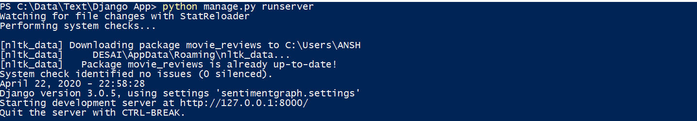
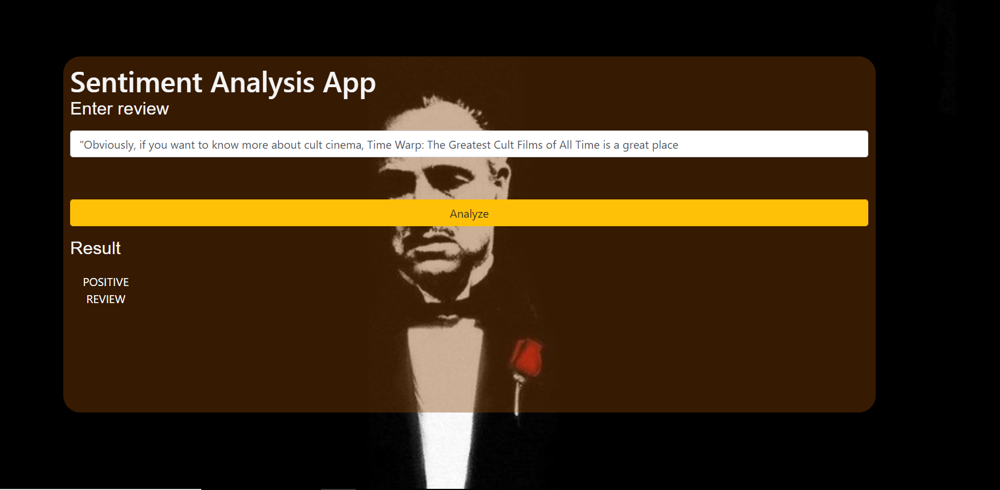

# Django-Application

This is sentiment analyis application of movie reviews. The dataset used is movie-reviews.
It classifies reviews as positive or negative reviews.

This is then hosted on local server using django framework.

Steps are :
1) Run the manage.py as runserver and open the link provided in web browser.

2) Enter any reviews of movies as a whole sentence and click Analyze.

The output is shown as below:

